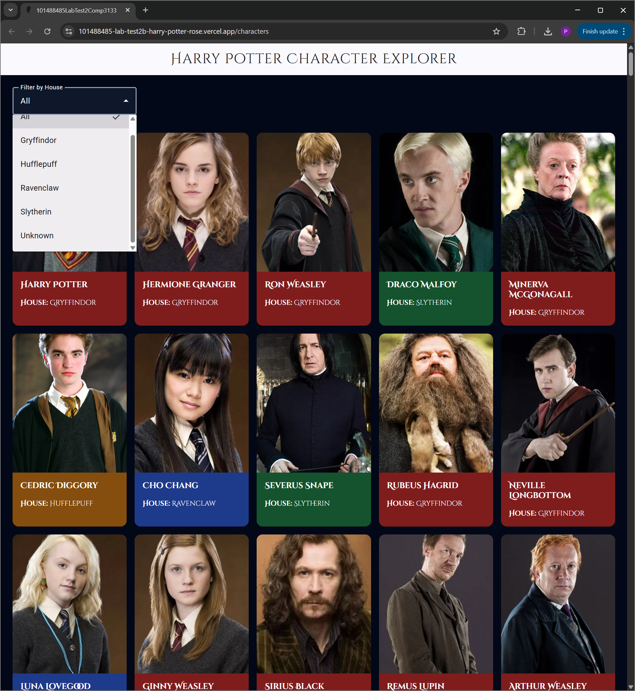
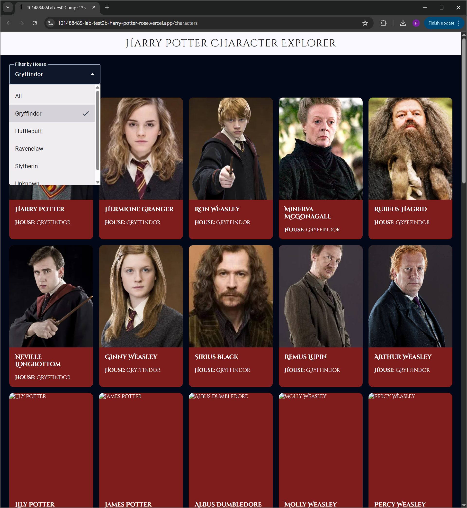
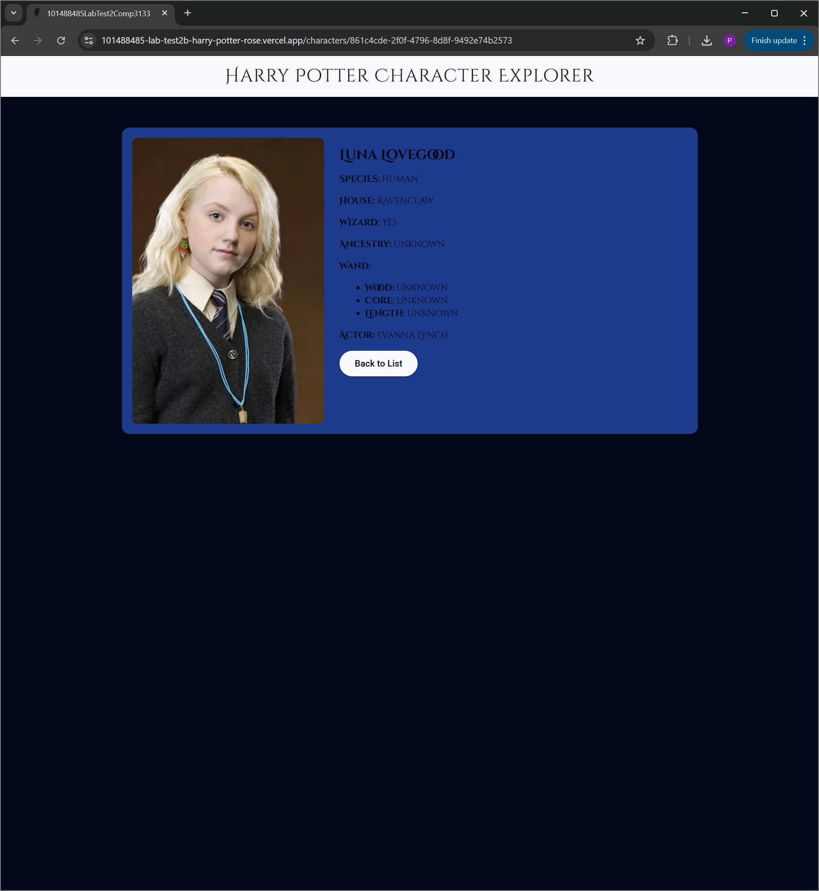

# 🧙‍♂️ Harry Potter Character Explorer

An Angular application that fetches and displays Harry Potter characters using a public REST API.
The app allows users to browse, filter, and view detailed information about characters with a themed UI.

---

## 🚀 Features

* 📋 Display a list of Harry Potter characters
* 🏠 Filter characters by Hogwarts house using a dropdown
* 🔍 View detailed information for each character
* 🎨 House-based color styling for cards and details view
* 🌙 Dark navy wizard-themed UI
* ⬆️ Back-to-top navigation
* ⚡ Uses Angular Signals for state management
* 🔁 Uses Reactive Forms for filtering
* 🧩 Custom Pipe for house display formatting
* 🧭 Angular routing with dynamic parameters

---

## 🛠️ Tech Stack

* Angular (Standalone Components)
* Angular Material
* TypeScript
* RxJS
* Angular Signals
* Reactive Forms
* REST API (HP API)
* Vercel (deployment)

---

## 📡 API Used

Harry Potter API:
https://hp-api.onrender.com/api

### Endpoints:

* All characters:
  `/characters`
* Characters by house:
  `/characters/house/:house`
* Character details:
  `/character/:id`

---

## 📂 Project Structure

```
src/app/
  models/
    character.model.ts

  services/
    character.service.ts

  pipes/
    house-display.pipe.ts

  character-list/
  character-filter/
  character-details/

  app.ts
  app.routes.ts
  app.config.ts
```

---

## ⚙️ Setup & Run Locally

### 1. Clone the repository

```
git clone https://github.com/PennyAhlstrom/101488485_lab_test2b_harry_potter.git
cd 101488485_lab_test2b_harry_potter
```

### 2. Install dependencies

```
npm install
```

### 3. Run the application

```
ng serve
```

Open in browser:

```
http://localhost:4200
```

---

## 🧠 Key Implementation Details

### 🔹 Angular Features Used

* `@for` → render character lists
* `@if` → conditional UI (loading, error states)
* `@switch` → conditional display (e.g., wizard status)
* **Signals** → manage selected house state
* **ReactiveFormsModule** → filter dropdown
* **Custom Pipe** → format house values

---

### 🔹 Service Layer

* `CharacterService` handles all API calls
* Uses Angular `HttpClient`
* Supports:

  * fetching all characters
  * fetching characters by house
  * fetching a character by ID

---

### 🔹 Data Model

* `Character` interface defines API structure
* Includes nested `wand` object

---

### 🔹 Filtering Logic

* Dropdown populated dynamically from API data
* Uses:

  * API calls for valid houses
  * local filtering for `"Unknown"`

---

### 🔹 Routing

* `/characters` → list + filter page
* `/characters/:id` → character details page

---

### 🔹 UI Design

* Angular Material components:

  * `MatToolbar`
  * `MatCard`
  * `MatSelect`
  * `MatButton`

* Custom styling:

  * house-based card colors
  * ultra dark navy background
  * fantasy-style title font

---

## 🌐 Deployment

The application is deployed using **Vercel**.

### Notes:

* SPA routing handled using `vercel.json` rewrite
* Client-side rendering (no prerendering)

---

## 📸 Running Application Screenshots

### 🔹 Character List View
**Caption:**  
The main character list view displaying data fetched from the API. Each character is shown using Angular Material cards with name, house (or "Unknown"), and image. House-based color styling is applied dynamically.
*(Displays all characters with house-colored cards)*



---

### 🔹 Filtered View
**Caption:**  
The filter functionality implemented using a reactive form dropdown. Selecting a house dynamically updates the displayed characters by calling the API endpoint or applying local filtering for "Unknown" values.
*(Shows characters filtered by selected house)*



---

### 🔹 Character Details View
**Caption:**  
The character details page accessed via Angular routing using a route parameter (`:id`). Displays extended information including species, ancestry, wand details, actor, and image, with house-based styling applied.
*(Displays detailed information for a selected character)*



---

## 🧪 Future Improvements

* Add search by character name
* Add pagination or lazy loading
* Cache API responses in the service
* Add house crest icons
* Improve accessibility and responsiveness

---

## 📄 License

This project is for academic purposes.

---

## 👤 Author

**Student ID:** 101488485
**Course:** COMP3133

---

## 📌 Submission Links

* GitHub Repository: 
https://github.com/PennyAhlstrom/101488485_lab_test2b_harry_potter

* Live Deployment (Vercel): 
https://101488485-lab-test2b-harry-potter-rose.vercel.app/
